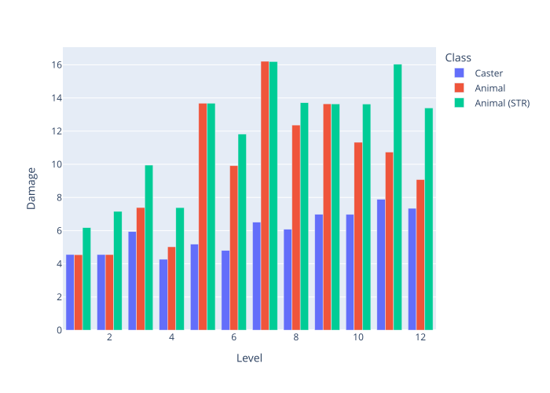

# Player Core Untamed Druid

Calculating the damage of a wild shape druid is tricky due to the way that the players to-hit bonus can *sometimes* be used in place of the animal form's shape. This comparison is used to look at the difference between three untamed build styles.

1. Caster progression, assuming a cantrip each round.
1. Dump STR, just rely on the forms bonus.
1. Pump STR, using whichever bonus is greater at any given time.

>At all levels, will use whichever heightened shapeshift form looks like it would do the most damage. Most forms have a lower-damage agile attack but previous testing has shown that this doesn't pan out overall.

>Two attacks per turn - this isn't always going to be realistic since transforming is a 2-action ability but it's constant between builds.

This comparison uses the [armor class progression](./example_2e_baseline.md) determined in the baseline analysis.

---

## Caster baseline

Just a straight caster build using [Gouging Claw](https://2e.aonprd.com/Spells.aspx?ID=1546) each turn.


|Level|MOD (WIS)|Proficiency bonus|Total attack|Damage|
|:---:|:---:|:---:|:---:|:---:|
|1|4|2|7|`2d6+2`|
|2|4|2|8|`2d6+2`|
|3|4|2|9|`3d6+3`|
|4|4|2|10|`3d6+3`|
|5|4.5|2|11|`4d6+4`|
|6|4.5|2|12|`4d6+4`|
|7|4.5|4|15|`5d6+5`|
|8|4.5|4|16|`5d6+5`|
|9|4.5|4|17|`6d6+6`|
|10|5|4|19|`6d6+6`|
|11|5|4|20|`7d6+7`|
|12|5|4|21|`7d6+7`|

```bash
AC_ARRAY=(16 17 18 21 22 24 25 27 28 30 31 33)

HIT_ARRAY=({7..12} {15..17} {19..21})
DMG_ARRAY=(2 2 3 3 4 4 5 5 6 6 7 7)

for i in {0..11};
do
    dpr_simulator --use-pf2e-criticals \
        --ac-targets ${AC_ARRAY[$i]} \
        --to-hit "1d20+${HIT_ARRAY[$i]}" \
        --weapon-details "${DMG_ARRAY[$i]}d6+${DMG_ARRAY[$i]}" \
        -o resources/Druid_caster.$((i+1)).parquet
done
```

---

## No-STR Animal build

Who needs STR? Just pump that CON and WIS and do other stuff. For level 1, casting a cantrip so assuming max WIS for the starting level.

|Level|Form|MOD|Proficiency bonus|Item bonus|Total attack|Damage|Notes|
|:---:|:---:|:---:|:---:|:---:|:---:|:---:|:---|
|1|[Gouging Claw](https://2e.aonprd.com/Spells.aspx?ID=1546)|4 (WIS)|2|0|7|`2d6+2`|Spell 1|
|2|[Gouging Claw](https://2e.aonprd.com/Spells.aspx?ID=1546)|4 (WIS)|2|0|8|`2d6+2`|Spell 1|
|3|[Animal Form](https://2e.aonprd.com/Spells.aspx?ID=1440)|-|-|-|9|`2d8+1`|Spell 2|
|4|[Animal Form](https://2e.aonprd.com/Spells.aspx?ID=1440)|-|-|-|9|`2d8+1`|Spell 2|
|5|[Animal Form](https://2e.aonprd.com/Spells.aspx?ID=1440)|-|-|-|14|`2d8+5`|Spell 3, stronger than [Insect Form](https://2e.aonprd.com/Spells.aspx?ID=1575)|
|6|[Animal Form](https://2e.aonprd.com/Spells.aspx?ID=1440)|-|-|-|14|`2d8+5`|Spell 3, stronger than [Insect Form](https://2e.aonprd.com/Spells.aspx?ID=1575)|
|7|[Animal Form](https://2e.aonprd.com/Spells.aspx?ID=1440)|-|-|-|16|`2d8+9`|Spell 4, stronger than [Insect Form](https://2e.aonprd.com/Spells.aspx?ID=1575)|
|8|[Animal Form](https://2e.aonprd.com/Spells.aspx?ID=1440)|-|-|-|16|`2d8+9`|Spell 4, stronger than [Insect Form](https://2e.aonprd.com/Spells.aspx?ID=1575) and equal to [Dinosaur Form](https://2e.aonprd.com/Spells.aspx?ID=1489)|
|9|[Animal Form](https://2e.aonprd.com/Spells.aspx?ID=1440)|-|-|-|18|`4d8+7`|Spell 5, stronger than [Insect Form](https://2e.aonprd.com/Spells.aspx?ID=1575)|
|10|[Animal Form](https://2e.aonprd.com/Spells.aspx?ID=1440)|-|-|-|18|`4d8+7`|Spell 5, stronger than [Insect Form](https://2e.aonprd.com/Spells.aspx?ID=1575)|
|11|[Aerial Form](https://2e.aonprd.com/Spells.aspx?ID=1437)|-|-|-|21|`4d8+4`|Spell 6, only shape available at this rank|
|12|[Aerial Form](https://2e.aonprd.com/Spells.aspx?ID=1437)|-|-|-|21|`4d8+4`|Spell 6, only shape available at this rank|


```bash
# First and Second level
dpr_simulator --use-pf2e-criticals --ac-targets 16 --to-hit "1d20+7" --weapon-details "2d6+2" -o resources/Druid_animal.1.parquet
dpr_simulator --use-pf2e-criticals --ac-targets 17 --to-hit "1d20+8" --weapon-details "2d6+2" -o resources/Druid_animal.2.parquet

# Third onward
AC_ARRAY=( 18 21 22 24 25 27 28 30 31 33)
HIT_ARRAY=( 9  9 14 14 16 16 18 18 21 21)
DMG_ARRAY=("2d8+1" "2d8+1" "2d8+5" "2d8+5" "2d8+9" "2d8+9" "4d8+7" "4d8+7" "4d8+4" "4d8+4")

for i in {0..9};
do
    dpr_simulator --use-pf2e-criticals \
        --ac-targets ${AC_ARRAY[$i]} \
        --to-hit "1d20+${HIT_ARRAY[$i]}" "1d20+${HIT_ARRAY[$i]}-5" \
        --weapon-details ${DMG_ARRAY[$i]} \
        -o resources/Druid_animal.$(($i+3)).parquet
done
```

---

## STR-based Animal build

Will occassionally make use of the higher PC to-hit bonus to keep the damage higher. Druids follow the [Non-martial progression](./example_2e_baseline.md), but are offset by the lower primary stat.

I'm unclear on how the [Untamed Form](https://2e.aonprd.com/Spells.aspx?ID=1861) status bonus relates to the wording on feats such as [Animal Form](https://2e.aonprd.com/Spells.aspx?ID=1440), specifically

```
When you choose to use your own attack modifier while polymorphed instead of the form's default attack modifier, you gain a +2 status bonus to your attack rolls.

...

If your unarmed attack bonus is higher, you can use it instead.
```

I've seen online interpretations where both the `+2 status bonus` is only given when the base attack bonus is greater than the form, or when the PC can include the `+2 status bonus` in determining whether or not their bonus is greater than the form. I am assuming for this simulation the later case, as otherwise it's impossible to get this bonus other than at Level 4. If this is not the case when the status bonus would appear to exist solely for when downcasting with [Form Control](https://2e.aonprd.com/Feats.aspx?ID=4723) or when multiclassing.

|Level|Form|MOD|Proficiency bonus|Item bonus|Status bonus|Total attack|Form attack|Final attack|Damage|Notes|
|:---:|:---:|:---:|:---:|:---:|:---:|:---:|:---:|:---:|:---:|:---|
|1|[Untamed Shift](https://2e.aonprd.com/Spells.aspx?ID=1862)|3|2|0|0|6|-|6|"1d6+3"|Spell 1|
|2|[Untamed Shift](https://2e.aonprd.com/Spells.aspx?ID=1862)|3|2|1|0|8|-|8|"1d6+3"|Spell 1, [Handwraps of Mighty Blows](https://2e.aonprd.com/Equipment.aspx?ID=3086)|
|3|[Animal Form](https://2e.aonprd.com/Spells.aspx?ID=1440)|3|2|1|2|11|9|11|`2d8+1`|Spell 2|
|4|[Animal Form](https://2e.aonprd.com/Spells.aspx?ID=1440)|3|2|1|2|12|9|12|`2d8+1`|Spell 2|
|5|[Animal Form](https://2e.aonprd.com/Spells.aspx?ID=1440)|4|2|1|2|14|14|14|`2d8+5`|Spell 3|
|6|[Animal Form](https://2e.aonprd.com/Spells.aspx?ID=1440)|4|2|1|2|15|14|15|`2d8+5`|Spell 3|
|7|[Animal Form](https://2e.aonprd.com/Spells.aspx?ID=1440)|4|2|1|2|16|16|16|`2d8+9`|Spell 4, stronger than [Insect Form](https://2e.aonprd.com/Spells.aspx?ID=1575)|
|8|[Animal Form](https://2e.aonprd.com/Spells.aspx?ID=1440)|4|2|1|2|17|16|17|`2d8+9`|Spell 4, stronger than [Insect Form](https://2e.aonprd.com/Spells.aspx?ID=1575)|
|9|[Animal Form](https://2e.aonprd.com/Spells.aspx?ID=1440)|4|2|1|2|18|18|18|`4d8+7`|Spell 5, stronger than [Insect Form](https://2e.aonprd.com/Spells.aspx?ID=1575)|
|10|[Animal Form](https://2e.aonprd.com/Spells.aspx?ID=1440)|4.5|2|2|2|20|18|20|`4d8+7`|Spell 5, stronger than [Insect Form](https://2e.aonprd.com/Spells.aspx?ID=1575)|
|11|[Aerial Form](https://2e.aonprd.com/Spells.aspx?ID=1437)|4.5|4|2|2|23|21|23|`4d8+4`|Spell 6, only shape available at this rank|
|12|[Aerial Form](https://2e.aonprd.com/Spells.aspx?ID=1437)|4.5|4|2|2|24|21|24|`4d8+4`|Spell 6, only shape available at this rank|

Technically `Animal Form` is still strong at levels 11 and 12, but due to the lower AC I'm ignoring it.

```bash
AC_ARRAY=( 16 17 18 21 22 24 25 27 28 30 31 33)
HIT_ARRAY=( 6  8 11 12 14 15 16 17 18 20 23 24)
DMG_ARRAY=("1d6+3" "1d6+3" "2d8+1" "2d8+1" "2d8+5" "2d8+5" "2d8+9" "2d8+9" "4d8+7" "4d8+7" "4d8+4" "4d8+4")

for i in {0..11};
do
    dpr_simulator --use-pf2e-criticals \
        --ac-targets ${AC_ARRAY[$i]} \
        --to-hit "1d20+${HIT_ARRAY[$i]}" "1d20+${HIT_ARRAY[$i]}-5" \
        --weapon-details ${DMG_ARRAY[$i]} \
        -o resources/Druid_STR.$(($i+1)).parquet
done
```

---

## Summary

```python
import glob
import polars as pl

def parse_input(input_file: str) -> pl.DataFrame:
    return (
        pl
        .scan_parquet(input_file)
        .with_columns(File=pl.lit(input_file))
        .with_columns(
            Class=pl.col('File').str.extract(r'resources/(\w+)\.', 1),
            Level=pl.col('File').str.extract(r'\.(\d+)\.', 1).cast(int)
        )
        .select('Iteration', 'Target_AC', 'Number_hits', 'Number_crits', 'Total_damage', 'Class', 'Level')
        .collect()
    )

input_data = [parse_input(input_file) for input_file in glob.glob('resources/*.parquet')]
rename_map = {'Druid_caster': 'Caster', 'Druid_animal': 'Animal', 'Druid_STR': 'Animal (STR)'}

df = (
    pl
    .concat(input_data, how='vertical')
    .with_columns(pl.col('Class').replace(rename_map))
)

(
    df
    .group_by(['Class', 'Level'])
    .agg(
        Hit=pl.col('Number_hits').mean(),
        Damage=pl.col('Total_damage').mean(),
    )
    .pivot(index='Level', on='Class', values=['Hit', 'Damage'])
    .sort('Level', descending=False)
)
```

|Level|Hit<br />Caster|<br />Animal (STR)|<br />Animal|Damage<br />Caster|<br />Animal (STR)|<br />Animal|
|:---:|:---:|:---:|:---:|:---:|:---:|:---:|
|1|0.60|0.85|0.60|4.6|6.2|4.5|
|2|0.60|0.95|0.60|4.6|7.2|4.6|
|3|0.60|1.15|0.95|5.9|10.0|7.4|
|4|0.50|0.95|0.65|4.3|7.4|5.0|
|5|0.50|1.05|1.05|5.2|13.7|13.7|
|6|0.45|0.95|0.85|4.8|11.8|9.9|
|7|0.55|0.95|0.95|6.5|16.2|16.2|
|8|0.50|0.85|0.75|6.1|13.7|12.4|
|9|0.450|0.85|0.85|7.0|13.6|13.6|
|10|0.50|0.85|0.65|7.0|13.6|11.3|
|11|0.50|1.04|0.85|7.9|16.0|10.7|
|12|0.45|0.95|0.65|7.3|13.4|9.1|

```python
import plotly.express as px

plt = (
    df
    .group_by(['Level', 'Class'])
    .agg(Damage=pl.col('Total_damage').mean())
)

fig = px.bar(
    plt,
    x='Level',
    y='Damage',
    color='Class',
    barmode='group',
)

fig.write_image('img/example_2e_druid.svg')
```



---
