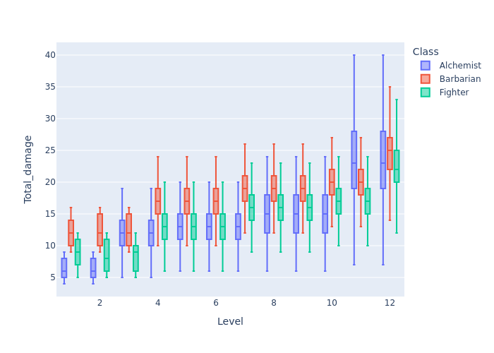

# Player Core Mutagenist

The new Mutagenist looks like a viable melee combatant with the remastered [Bestial Mutagen](https://2e.aonprd.com/Equipment.aspx?ID=3315). Using the tool to do a level-by-level comparison with a Fighter and Barbarian, each using a one-handed weapon, just as a comparison. The Alchemist will certainly be lower in DPR but this is just to see what the gap is.

---

## Alchemist

Assuming a start with +3 STR, bumping to +4 at Level 5, and +4.5 at Level 10. Will be using the new [Bestial Mutagen](https://2e.aonprd.com/Equipment.aspx?ID=3315) as appropriate by level, which is factored into the table below. Going fully into strength might not be the best way to build a character, but it will be the highest DPR way so using it here.

Alchemists follow the [Martial/Trained](./example_2e_baseline.md) progression, but it is re-written here due to the greater item bonuses to hit from [Bestial Mutagen](https://2e.aonprd.com/Equipment.aspx?ID=3315).

|Level|STR|Proficiency bonus|Item bonus|Total attack|Damage|Notes|
|:---:|:---:|:---:|:---:|:---:|:---:|:---:|
|1|3|2|1|7|`1d6+3`|`Bestial Mutagen (Lesser)`, +1 item bonus|
|2|3|2|1|8|`1d6+3`||
|3|3|2|2|10|`2d8+3`|`Bestial Mutagen (Moderate)`, +2 item bonus|
|4|3|2|2|11|`2d8+3`||
|5|4|2|2|13|`2d8+4`||
|6|4|2|2|14|`2d8+4`||
|7|4|4|2|17|`2d8+4`||
|8|4|4|2|18|`2d10~10+4`|`Mutant Physique` feat, die size increases and gains `Deadly d10`|
|9|4|4|2|19|`2d10~10+4`||
|10|4|4|2|20|`2d10~10+4`|Ability score increase, but only to 4.5|
|11|4|4|3|22|`3d12~12+4`|`Bestial Mutagen (Greater)`, +3 item bonus|
|12|4|4|3|23|`3d12~12+4`||

<details>
<summary>Attack strategy</summary>

A quick comparison of going for 2x Jaws attacks, or 1x Jaws, 1x Claws while under Beastial Mutagen:

* STR 4
* To hit = +4 (STR) +5 (LEVEL) +2 (TRAINED) +2 (MUTAGEN)
* Using a `Beastial Mutagen (moderate)` as provided in **Player Core 2** (not yet on [Archives of Nethys](https://2e.aonprd.com/)).

Jaws & claws:

```bash
dpr_simulator --use-pf2e-criticals --ac-targets 14 16 18 20 22 24 --to-hit "1d20+13" "1d20+9" --weapon-details "2d8+4" "2d6+4"
```

Using bite twice

```bash
dpr_simulator --use-pf2e-criticals --ac-targets 14 16 18 20 22 24 --to-hit "1d20+13" "1d20+8" --weapon-details "2d8+4"
```

|Build|Target AC<br />14|<br />16|<br />18|<br />20|<br />22|<br />24|
|:---|:---:|:---:|:---:|:---:|:---:|:---:|
|Mutagenist (jaws & claws)|28.53|24.41|19.60|16.44|12.75|11.00|
|Mutagenist (jaws only)|29.25|24.71|19.50|16.89|12.99|11.05|

So for max DPR, double-Jaws is the way to go but the different is less than 1 DPR.

</details>

```bash
ac_array=(16 17 18 21 22 24 25 27 28 30 31 33)
hit_array=(7 8 10 11 13 14 17 18 19 20 22 23)
dmg_array=("1d6+3" "1d6+3" "2d8+3" "2d8+3" "2d8+4" "2d8+4" "2d8+4" "2d10~10+4" "2d10~10+4" "2d10~10+4" "3d12~12+4" "3d12~12+4")

for i in {0..11};
do
    dpr_simulator --use-pf2e-criticals \
        --ac-targets ${ac_array[$i]} \
        --to-hit "1d20+${hit_array[$i]}" "1d20+${hit_array[$i]}-5" \
        --weapon-details ${dmg_array[$i]} \
        -o resources/Alchemist_$(($i+1)).parquet
done
```

---

## Fighter

Playing as a 1H build. Not assuming any particular feats, because there are none which strictly add damage like the `Mutant Physique` feat does above. Starting with 4 STR, bumping to 4.5 at Level 5 and 5 at Level 10.

Using a `1d8` weapon, with runes added at their item level.

Fighters follow the [Martial/Expert progression](./example_2e_baseline.md).

|Level|Attack bonus|Damage|Notes|
|:---:|:---:|:---:|:---|
|1|9|`1d8+4`||
|2|11|`1d8+4`|[Weapon Potency +1](https://2e.aonprd.com/Equipment.aspx?ID=2830)|
|3|12|`1d8+4`||
|4|13|`2d8+4`|[Striking Rune](https://2e.aonprd.com/Equipment.aspx?ID=2829)|
|5|16|`2d8+4`|Ability score increase, but only to 4.5|
|6|17|`2d8+4`||
|7|18|`2d8+7`|Weapon Specialisation, +3 damage for Master proficiency|
|8|19|`2d8+7`||
|9|21|`2d8+7`|[Weapon Potency +2](https://2e.aonprd.com/Equipment.aspx?ID=2830)|
|10|23|`2d8+8`|Ability score increase to 5|
|11|24|`2d8+8`||
|12|25|`3d8+9`|[Striking Rune (Greater)](https://2e.aonprd.com/Equipment.aspx?ID=2829), Weapon Specialisation, +4 damage for Legendary proficiency|

```bash
ac_array=(16 17 18 21 22 24 25 27 28 30 31 33)
hit_array=(9 11 12 13 16 17 18 19 21 23 24 25)
dmg_array=("1d8+4" "1d8+4" "1d8+4" "2d8+4" "2d8+4" "2d8+4" "2d8+7" "2d8+7" "2d8+7" "2d8+8" "2d8+8" "3d8+9")

for i in {0..11};
do
    dpr_simulator --use-pf2e-criticals \
        --ac-targets ${ac_array[$i]} \
        --to-hit "1d20+${hit_array[$i]}" "1d20+${hit_array[$i]}-5" \
        --weapon-details ${dmg_array[$i]} \
        -o resources/Fighter_$(($i+1)).parquet
done
```

---

## Barbarian

* Playing as a 1H build.
* Dragon Instinct, which is mostly just a flat damage boost here.
* Starting with 4 STR, bumping to 4.5 at Level 5 and 5 at Level 10.

Using a `1d8` weapon, with runes added at their item level.

Barbarians follow the [Martial/Trained progression](./example_2e_baseline.md).

|Level|Total attack|Damage|Notes|
|:---:|:---:|:---:|:---|
|1|7|`1d8+8`|[Dragon Instinct](https://2e.aonprd.com/Instincts.aspx?ID=2), +4 damage when raging|
|2|9|`1d8+8`|[Weapon Potency (+1 hit)](https://2e.aonprd.com/Equipment.aspx?ID=2830)|
|3|10|`1d8+8`||
|4|11|`2d8+8`|[Striking Rune](https://2e.aonprd.com/Equipment.aspx?ID=2829)|
|5|14|`2d8+8`|Ability score increase, but only to 4.5|
|6|15|`2d8+8`||
|7|16|`2d8+10`|[Weapon Specialization (+2 damage)](https://2e.aonprd.com/Classes.aspx?ID=2)|
|8|17|`2d8+10`||
|9|19|`2d8+10`|[Weapon Potency (+2 hit)](https://2e.aonprd.com/Equipment.aspx?ID=2830)|
|10|21|`2d8+11`|Ability score increase to 5|
|11|22|`2d8+11`||
|12|23|`3d8+11`|[Striking Rune (Greater)](https://2e.aonprd.com/Equipment.aspx?ID=2829)|

```bash
ac_array=(16 17 18 21 22 24 25 27 28 30 31 33)
hit_array=(7 9 10 11 14 15 16 17 19 21 22 23)
dmg_array=("1d8+8" "1d8+8" "1d8+8" "2d8+8" "2d8+8" "2d8+8" "2d8+10" "2d8+10" "2d8+10" "2d8+11" "2d8+11" "3d8+11")

for i in {0..11};
do
    dpr_simulator --use-pf2e-criticals \
        --ac-targets ${ac_array[$i]} \
        --to-hit "1d20+${hit_array[$i]}" "1d20+${hit_array[$i]}-5" \
        --weapon-details ${dmg_array[$i]} \
        -o resources/Barbarian_$(($i+1)).parquet
done
```

---

## Summary

```python
import os
import glob
import polars as pl
import plotly.express as px

buffer = []
for file_name in glob.glob('resources/*.parquet'):
    file_stub, _ = os.path.splitext(file_name)
    pc_class, pc_level = file_stub.split('_')
    pc_class = os.path.split(pc_class)[-1]
    buffer.append(
        pl
        .scan_parquet(file_name)
        .with_columns(
            Class=pl.lit(pc_class),
            Level=pl.lit(pc_level).cast(pl.Int32)
        )
        .collect()
    )

df = pl.concat(buffer)

(
    df
    .with_columns(
        hit_mask=pl.col('Number_hits').gt(0)
    )
    .group_by(['Class', 'Level'])
    .agg(
        pl.col('Total_damage').median().alias('Median_damage'),
        (pl.col('hit_mask').sum()/pl.col('Number_hits').count()*100).alias('Hit_perc')
    )
    .pivot(index='Level', on='Class', values=['Hit_perc', 'Median_damage'])
    .sort('Level', descending=False)
)

# View the distribution for a single hit, non-critical
plot_df = (
    df
    .filter(
        pl.col('Number_hits').eq(1).over(['Level', 'Class']),
        pl.col('Number_crits').eq(0)
    )
)

fig = px.box(plot_df, x='Level', y='Total_damage', color='Class', points=False)
fig.write_image('images/example_2e_mutagenist.png')
```

|Level|Alchemist<br />Hit chance|<br />DPR|Fighter<br />Hit chance|<br />DPR|Barbarian<br />Hit chance|<br />DPR|
|:---:|:---:|:---:|:---:|:---:|:---:|:---:|
|1|74.0|7|83.5|11|73.9|13|
|2|74.0|7|87.5|12|79.0|14|
|3|79.0|14|87.5|12|79.0|14|
|4|68.5|11|78.9|15|68.5|16|
|5|74.0|13|87.5|19|79.0|19|
|6|68.6|12|83.5|16|73.9|17|
|7|79.0|15|83.5|20|74.0|19|
|8|74.0|15|79.0|18|68.5|18|
|9|74.0|15|83.5|20|74.0|19|
|10|68.5|14|83.5|21|74.0|20|
|11|73.9|24|83.5|21|74.1|20|
|12|68.5|22|79.0|25|68.5|23|



---
