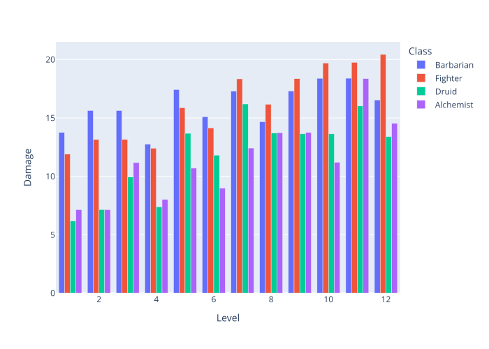

# Player Core Mutagenist

The new Mutagenist looks like a viable melee combatant with the remastered [Bestial Mutagen](https://2e.aonprd.com/Equipment.aspx?ID=3315). Using the tool to do a level-by-level comparison with a Fighter and Barbarian, each using a one-handed weapon, just as a comparison. The Alchemist will certainly be lower in DPR but this is just to see what the gap is.

---

## Alchemist

Assuming a start with +3 STR, bumping to +4 at Level 5, and +4.5 at Level 10. Will be using the new [Bestial Mutagen](https://2e.aonprd.com/Equipment.aspx?ID=3315) as appropriate by level, which is factored into the table below. Going fully into strength might not be the best way to build a character, but it will be the highest DPR way so using it here.

Alchemists follow the [Martial/Trained](./example_2e_baseline.md) progression, but they get access to greater item bonuses from [Bestial Mutagen](https://2e.aonprd.com/Equipment.aspx?ID=3315), although a lower STR score than the martial.

|Level|STR|Proficiency bonus|Item bonus|Total attack|Damage|Notes|
|:---:|:---:|:---:|:---:|:---:|:---:|:---:|
|1|3|2|1|7|`1d6+3`|`Bestial Mutagen (Lesser)`, +1 item bonus|
|2|3|2|1|8|`1d6+3`||
|3|3|2|2|10|`2d8+3`|`Bestial Mutagen (Moderate)`, +2 item bonus|
|4|3|2|2|11|`2d8+3`||
|5|4|2|2|13|`2d8+4`||
|6|4|2|2|14|`2d8+4`||
|7|4|4|2|17|`2d8+4`||
|8|4|4|2|18|`2d10[deadly10]+4`|`Mutant Physique` feat, die size increases and gains `Deadly d10`|
|9|4|4|2|19|`2d10[deadly10]+4`||
|10|4|4|2|20|`2d10[deadly10]+4`|Ability score increase, but only to 4.5|
|11|4|4|3|22|`3d12[deadly12]+4`|`Bestial Mutagen (Greater)`, +3 item bonus|
|12|4|4|3|23|`3d12[deadly12]+4`||

<br />

<details>
<summary>Attack strategy</summary>

A quick comparison of going for 2x Jaws attacks, or 1x Jaws, 1x Claws while under Beastial Mutagen:

* STR 4
* To hit = +4 (STR) +5 (LEVEL) +2 (TRAINED) +2 (MUTAGEN)
* Using a `Beastial Mutagen (moderate)` as provided in **Player Core 2**.

```bash
# Jaws & claws
dpr_simulator --use-pf2e-criticals --ac-targets 20 21 22 --to-hit "1d20+13" "1d20+13-4" --weapon-details "2d8+4" "2d6+4"

# Double bite
dpr_simulator --use-pf2e-criticals --ac-targets 20 21 22 --to-hit "1d20+13" "1d20+13-5" --weapon-details "2d8+4"
```

|Build|AC20|AC21|AC22|
|:---|:---:|:---:|:---:|
|Jaws & claws|13.93|12.23|10.56|
|Double bite|14.15|12.44|10.70|

So for max DPR, double-Jaws is the way to go but the different is less than 1 DPR.

</details>

<br />

```bash
AC_ARRAY=( 16 17 18 21 22 24 25 27 28 30 31 33)
HIT_ARRAY=( 7 8 10 11 13 14 17 18 19 20 22 23)
DMG_ARRAY=(
    "1d6+3" "1d6+3"                                          # Level 1 - 2
    "2d8+3" "2d8+3" "2d8+4" "2d8+4" "2d8+4"                  # Level 3 - 7
    "2d10[deadly10]+4" "2d10[deadly10]+4" "2d10[deadly10]+4" # Level 8 - 10
    "3d12[deadly12]+4" "3d12[deadly12]+4"                    # Level 11 - 12
)

for i in {0..11};
do
    dpr_simulator --use-pf2e-criticals \
        --ac-targets ${AC_ARRAY[$i]} \
        --to-hit "1d20+${HIT_ARRAY[$i]}" "1d20+${HIT_ARRAY[$i]}-5" \
        --weapon-details ${DMG_ARRAY[$i]} \
        -o resources/Alchemist.$(($i+1)).parquet
done
```

---

## Fighter

Playing as a 1H build. Not assuming any particular feats, because there are none which strictly add damage like the `Mutant Physique` feat does above. Starting with 4 STR, bumping to 4.5 at Level 5 and 5 at Level 10.

Using a `1d8` weapon, with runes added at their item level.

Fighters follow the [Martial/Expert progression](./example_2e_baseline.md).

|Level|Attack bonus|Damage|Notes|
|:---:|:---:|:---:|:---|
|1|9|`1d8+4`||
|2|11|`1d8+4`|[Weapon Potency +1](https://2e.aonprd.com/Equipment.aspx?ID=2830)|
|3|12|`1d8+4`||
|4|13|`2d8+4`|[Striking Rune](https://2e.aonprd.com/Equipment.aspx?ID=2829)|
|5|16|`2d8+4`|Ability score increase, but only to 4.5|
|6|17|`2d8+4`||
|7|18|`2d8+7`|Weapon Specialisation, +3 damage for Master proficiency|
|8|19|`2d8+7`||
|9|21|`2d8+7`|[Weapon Potency +2](https://2e.aonprd.com/Equipment.aspx?ID=2830)|
|10|23|`2d8+8`|Ability score increase to 5|
|11|24|`2d8+8`||
|12|25|`3d8+9`|[Striking Rune (Greater)](https://2e.aonprd.com/Equipment.aspx?ID=2829), Weapon Specialisation, +4 damage for Legendary proficiency|

```bash
AC_ARRAY=( 16 17 18 21 22 24 25 27 28 30 31 33)
HIT_ARRAY=( 9 11 12 13 16 17 18 19 21 23 24 25)
DMG_ARRAY=("1d8+4" "1d8+4" "1d8+4" "2d8+4" "2d8+4" "2d8+4" "2d8+7" "2d8+7" "2d8+7" "2d8+8" "2d8+8" "3d8+9")

for i in {0..11};
do
    dpr_simulator --use-pf2e-criticals \
        --ac-targets ${AC_ARRAY[$i]} \
        --to-hit "1d20+${HIT_ARRAY[$i]}" "1d20+${HIT_ARRAY[$i]}-5" \
        --weapon-details ${DMG_ARRAY[$i]} \
        -o resources/Fighter.$(($i+1)).parquet
done
```

---

## Barbarian

* Playing as a 1H build.
* Dragon Instinct, which is mostly just a flat damage boost here.
* Starting with 4 STR, bumping to 4.5 at Level 5 and 5 at Level 10.

Using a `1d8` weapon, with runes added at their item level.

Barbarians follow the [Martial/Trained progression](./example_2e_baseline.md).

|Level|Total attack|Damage|Notes|
|:---:|:---:|:---:|:---|
|1|7|`1d8+8`|[Dragon Instinct](https://2e.aonprd.com/Instincts.aspx?ID=2), +4 damage when raging|
|2|9|`1d8+8`|[Weapon Potency (+1 hit)](https://2e.aonprd.com/Equipment.aspx?ID=2830)|
|3|10|`1d8+8`||
|4|11|`2d8+8`|[Striking Rune](https://2e.aonprd.com/Equipment.aspx?ID=2829)|
|5|14|`2d8+8`|Ability score increase, but only to 4.5|
|6|15|`2d8+8`||
|7|16|`2d8+10`|[Weapon Specialization (+2 damage)](https://2e.aonprd.com/Classes.aspx?ID=2)|
|8|17|`2d8+10`||
|9|19|`2d8+10`|[Weapon Potency (+2 hit)](https://2e.aonprd.com/Equipment.aspx?ID=2830)|
|10|21|`2d8+11`|Ability score increase to 5|
|11|22|`2d8+11`||
|12|23|`3d8+11`|[Striking Rune (Greater)](https://2e.aonprd.com/Equipment.aspx?ID=2829)|

```bash
AC_ARRAY=( 16 17 18 21 22 24 25 27 28 30 31 33)
HIT_ARRAY=( 7 9 10 11 14 15 16 17 19 21 22 23)
DMG_ARRAY=("1d8+8" "1d8+8" "1d8+8" "2d8+8" "2d8+8" "2d8+8" "2d8+10" "2d8+10" "2d8+10" "2d8+11" "2d8+11" "3d8+11")

for i in {0..11};
do
    dpr_simulator --use-pf2e-criticals \
        --ac-targets ${AC_ARRAY[$i]} \
        --to-hit "1d20+${HIT_ARRAY[$i]}" "1d20+${HIT_ARRAY[$i]}-5" \
        --weapon-details ${DMG_ARRAY[$i]} \
        -o resources/Barbarian.$(($i+1)).parquet
done
```

---

## Summary

Pull in the STR-based Druid from the [Druid anaylsis](./example_2e_druid.md#str-based-animal-build) for another comparison point.

```python
import glob
import polars as pl

def parse_input(input_file: str) -> pl.DataFrame:
    return (
        pl
        .scan_parquet(input_file)
        .with_columns(File=pl.lit(input_file))
        .with_columns(
            Class=pl.col('File').str.extract(r'resources/(\w+)\.', 1),
            Level=pl.col('File').str.extract(r'\.(\d+)\.', 1).cast(int)
        )
        .select('Iteration', 'Target_AC', 'Number_hits', 'Number_crits', 'Total_damage', 'Class', 'Level')
        .collect()
    )

input_data = [parse_input(input_file) for input_file in glob.glob('resources/*.parquet')]
rename_map = 

df = (
    pl
    .concat(input_data, how='vertical')
    .filter(~pl.col('Class').is_in(['Druid_caster', 'Druid_animal'])) # Drop the unwanted Druid details
    .with_columns(pl.col('Class').replace({'Druid_STR': 'Druid'}))
)

(
    df
    .group_by(['Class', 'Level'])
    .agg(
        Hit=pl.col('Number_hits').mean(),
        Damage=pl.col('Total_damage').mean(),
    )
    .pivot(index='Level', on='Class', values=['Hit', 'Damage'])
    .sort('Level', descending=False)
)
```

|Level|Hit<br />Alchemist|<br />Druid|<br />Barbarian|<br />Fighter|Damage<br />Alchemist|<br />Druid|<br />Barbarian|<br />Fighter|
|:---:|:---:|:---:|:---:|:---:|:---:|:---:|:---:|:---:|
|1|0.95|0.85|0.95|1.15|7.15|6.2|13.8|11.9|
|2|0.95|0.95|1.05|1.25|7.15|7.2|15.6|13.2|
|3|1.05|1.15|1.05|1.25|11.2|10.0|15.6|13.2|
|4|0.85|0.95|0.85|1.05|8.0|7.4|12.8|12.4|
|5|0.95|1.05|1.05|1.25|10.7|13.7|17.4|15.9|
|6|0.85|0.95|0.95|1.15|9.0|11.8|15.1|14.2|
|7|1.05|0.95|0.95|1.15|12.4|16.2|17.3|18.3|
|8|0.95|0.85|0.85|1.05|13.7|13.7|14.7|16.2|
|9|0.95|0.85|0.95|1.15|13.8|13.6|17.3|18.4|
|10|0.85|0.85|0.95|1.15|11.2|13.6|18.4|19.7|
|11|0.95|1.05|0.95|1.15|18.4|16.0|18.4|19.8|
|12|0.85|0.95|0.85|1.05|14.5|13.4|16.5|20.4|

```python
import plotly.express as px

plt = df.group_by(['Level', 'Class']).agg(Damage=pl.col('Total_damage').mean())

fig = px.bar(
    plt,
    x='Level',
    y='Damage',
    color='Class',
    barmode='group',
)

fig.write_image('img/example_2e_mutagenist.svg')
```



---
