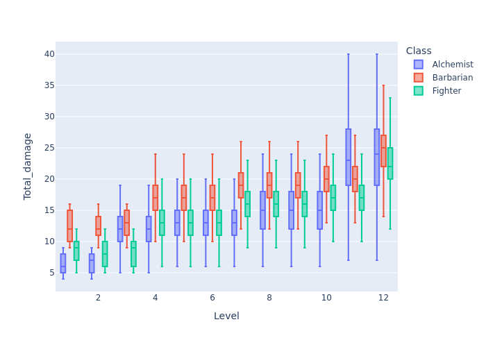

# Player Core Mutagenist

The new Mutagenist looks like a viable melee combatant with the remastered **Bestial Mutagen**. Using the tool to do a level-by-level comparison with a Fighter and Barbarian, each using a one-handed weapon, just as a comparison. The Alchemist will certainly be lower in DPR but this is just to see what the gap is.

Skimming through the `Monster Core` book, there are 348 creatures from level `-1` to `12`. Summarising their average AC by level:

|Level|Number of entries|Mean AC|Median AC|
|-1|18|14.8|15.0|
|0|11|15.1|15.0|
|1|53|16.1|16.0|
|2|41|17.4|17.0|
|3|44|17.9|18.0|
|4|34|20.7|21.0|
|5|28|21.0|21.5|
|6|24|23.2|24.0|
|7|21|24.5|25.0|
|8|19|26.6|27.0|
|9|19|27.1|28.0|
|10|16|29.8|30.0|
|11|10|30.8|31.0|
|12|10|32.3|33.0|

Rather than run against a series of AC values, will run against the average of each, for each level.

---

## Character builds

All characters will build for one-handed damage, two attacks per round.

### Alchemist

Assuming a start with +3 STR, bumping to +4 at Level 5, and +4.5 at Level 10. Will be using the new Beastial Mutagen as appropriate by level, which is factored into the table below. Going fully into strength might not be the best way to build a character, but it will be the highest DPR way so using it here.

|Level|STR|Proficiency bonus|Item bonus|Total attack|Damage|Notes|
|:---:|:---:|:---:|:---:|:---:|:---:|:---:|
|1|3|2|1|7|`1d6+3`|`Bestial Mutagen (Lesser)`, +1 item bonus|
|2|3|2|1|8|`1d6+3`||
|3|3|2|2|10|`2d8+3`|`Bestial Mutagen (Moderate)`, +2 item bonus|
|4|3|2|2|11|`2d8+3`||
|5|4|2|2|13|`2d8+4`||
|6|4|2|2|14|`2d8+4`||
|7|4|4|2|17|`2d8+4`||
|8|4|4|2|18|`2d10~10+4`|`Mutant Physique` feat, die size increases and gains `Deadly d10`|
|9|4|4|2|19|`2d10~10+4`||
|10|4|4|2|20|`2d10~10+4`|Ability score increase, but only to 4.5|
|11|4|4|3|22|`3d12~12+4`|`Bestial Mutagen (Greater)`, +3 item bonus|
|12|4|4|3|23|`3d12~12+4`||

<details>
<summary>Attack strategy</summary>

A quick comparison of going for 2x Jaws attacks, or 1x Jaws, 1x Claws while under Beastial Mutagen:

* STR 4
* To hit = +4 (STR) +5 (LEVEL) +2 (TRAINED) +2 (MUTAGEN)
* Using a `Beastial Mutagen (moderate)` as provided in **Player Core 2** (not yet on [Archives of Nethys](https://2e.aonprd.com/)).

Jaws & claws:

```bash
dpr_simulator --use-pf2e-criticals --ac-targets 14 16 18 20 22 24 --to-hit "1d20+13" "1d20+9" --weapon-details "2d8+4" "2d6+4"
```

Using bite twice

```bash
dpr_simulator --use-pf2e-criticals --ac-targets 14 16 18 20 22 24 --to-hit "1d20+13" "1d20+8" --weapon-details "2d8+4"
```

|Build|Target AC<br />14|<br />16|<br />18|<br />20|<br />22|<br />24|
|:---|:---:|:---:|:---:|:---:|:---:|:---:|
|Mutagenist (jaws & claws)|28.53|24.41|19.60|16.44|12.75|11.00|
|Mutagenist (jaws only)|29.25|24.71|19.50|16.89|12.99|11.05|

So for max DPR, double-Jaws is the way to go but the different is less than 1 DPR.

</details>

```bash
ac_array=(16 17 18 21 22 24 25 27 28 30 31 33)
hit_array=(7 8 10 11 13 14 17 18 19 20 22 23)
dmg_array=("1d6+3" "1d6+3" "2d8+3" "2d8+3" "2d8+4" "2d8+4" "2d8+4" "2d10~10+4" "2d10~10+4" "2d10~10+4" "3d12~12+4" "3d12~12+4")

for i in {0..11};
do
    dpr_simulator --use-pf2e-criticals --ac-targets ${ac_array[$i]} --to-hit "1d20+${hit_array[$i]}" "1d20+${hit_array[$i]}-5" --weapon-details ${dmg_array[$i]} -o Alchemist_$(($i+1)).parquet
done
```

---

### Fighter

Playing as a 1H build. Not assuming any particular feats, because there are none which strictly add damage like the `Mutant Physique` feat does above. Starting with 4 STR, bumping to 4.5 at Level 5 and 5 at Level 10.

Using a `1d8` weapon, with runes added at their item level.

|Level|STR|Proficiency bonus|Item bonus|Total attack|Damage|Notes|
|:---:|:---:|:---:|:---:|:---:|:---:|:---:|
|1|4|4|0|9|`1d8+4`||
|2|4|4|1|11|`1d8+4`|[Weapon Potency +1](https://2e.aonprd.com/Equipment.aspx?ID=2830)|
|3|4|4|1|12|`1d8+4`||
|4|4|6|1|15|`2d8+4`|[Striking Rune](https://2e.aonprd.com/Equipment.aspx?ID=2829)|
|5|4|6|1|16|`2d8+4`|Ability score increase, but only to 4.5|
|6|4|6|1|17|`2d8+4`||
|7|4|6|1|18|`2d8+7`|Weapon Specialisation, +3 damage for Master proficiency|
|8|4|6|1|19|`2d8+7`||
|9|4|6|2|21|`2d8+7`|[Weapon Potency +2](https://2e.aonprd.com/Equipment.aspx?ID=2830)|
|10|5|6|2|23|`2d8+8`|Ability score increase to 5|
|11|5|6|2|24|`2d8+8`||
|12|5|8|2|27|`3d8+9`|[Striking Rune (Greater)](https://2e.aonprd.com/Equipment.aspx?ID=2829), Weapon Specialisation, +4 damage for Legendary proficiency|

```bash
ac_array=(16 17 18 21 22 24 25 27 28 30 31 33)
hit_array=(9 11 12 15 16 17 18 19 21 23 24 27)
dmg_array=("1d8+4" "1d8+4" "1d8+4" "2d8+4" "2d8+4" "2d8+4" "2d8+7" "2d8+7" "2d8+7" "2d8+8" "2d8+8" "3d8+9")

for i in {0..11};
do
    dpr_simulator --use-pf2e-criticals --ac-targets ${ac_array[$i]} --to-hit "1d20+${hit_array[$i]}" "1d20+${hit_array[$i]}-5" --weapon-details ${dmg_array[$i]} -o Fighter_$(($i+1)).parquet
done
```

---

### Barbarian

* Playing as a 1H build.
* Dragon Instinct, which is mostly just a flat damage boost here.
* Starting with 4 STR, bumping to 4.5 at Level 5 and 5 at Level 10.


Using a `1d8` weapon, with runes added at their item level.

|Level|STR|Proficiency bonus|Item bonus|Total attack|Damage|Notes|
|:---:|:---:|:---:|:---:|:---:|:---:|:---:|

Item|Total|Damage|Notes|

|1|4|2|0|7|`1d8+8`|[Dragon Instinct](https://2e.aonprd.com/Instincts.aspx?ID=2), +4 damage when raging|
|2|4|2|1|9|`1d8+8`|[Weapon Potency (+1 hit)](https://2e.aonprd.com/Equipment.aspx?ID=2830)|
|3|4|2|1|10|`1d8+8`||
|4|4|2|1|11|`2d8+8`|[Striking Rune](https://2e.aonprd.com/Equipment.aspx?ID=2829)|
|5|4|4|1|14|`2d8+8`|Ability score increase, but only to 4.5|
|6|4|4|1|15|`2d8+8`||
|7|4|4|1|16|`2d8+10`|[Weapon Specialization (+2 damage)](https://2e.aonprd.com/Classes.aspx?ID=2)|
|8|4|4|1|17|`2d8+10`||
|9|4|4|2|19|`2d8+10`|[Weapon Potency (+2 hit)](https://2e.aonprd.com/Equipment.aspx?ID=2830)|
|10|5|4|2|21|`2d8+11`|Ability score increase to 5|
|11|5|4|2|22|`2d8+11`||
|12|5|4|2|23|`3d8+11`|[Striking Rune (Greater)](https://2e.aonprd.com/Equipment.aspx?ID=2829)|

```bash
ac_array=(16 17 18 21 22 24 25 27 28 30 31 33)
hit_array=(7 9 10 11 14 15 16 17 19 21 22 23)
dmg_array=("1d8+8" "1d8+8" "1d8+8" "2d8+8" "2d8+8" "2d8+8" "2d8+10" "2d8+10" "2d8+10" "2d8+11" "2d8+11" "3d8+11")

for i in {0..11};
do
    dpr_simulator --use-pf2e-criticals --ac-targets ${ac_array[$i]} --to-hit "1d20+${hit_array[$i]}" "1d20+${hit_array[$i]}-5" --weapon-details ${dmg_array[$i]} -o Barbarian_$(($i+1)).parquet
done
```

---

### Summary

```python
import os
import glob
import polars as pl
import plotly.express as px

buffer = []
for file_name in glob.glob('*.parquet'):
    file_stub, _ = os.path.splitext(file_name)
    pc_class, pc_level = file_stub.split('_')
    buffer.append(
        pl
        .scan_parquet(file_name)
        .with_columns(
            Class=pl.lit(pc_class),
            Level=pl.lit(pc_level).cast(pl.Int32)
        )
        .collect()
    )

df = pl.concat(buffer)

(
    df
    .with_columns(
        hit_mask=pl.col('Number_hits').gt(0)
    )
    .group_by(['Class', 'Level'])
    .agg(
        pl.col('Total_damage').median(),
        (pl.col('hit_mask').sum()/pl.col('Number_hits').count()*100).alias('Hit_perc')
    )
    .pivot(index='Level', on='Class', values=['Hit_perc', 'Total_damage'])
    .sort('Level', descending=False)
    .select('Level', 'Hit_perc_Alchemist', 'Total_damage_Alchemist', 'Hit_perc_Fighter', 'Total_damage_Fighter', 'Hit_perc_Barbarian', 'Total_damage_Barbarian')
    .write_csv('test.txt', separator='\t')
)

# View the distribution for a single hit, non-critical
plot_df = (
    df
    .filter(
        pl.col('Number_hits').eq(1).over(['Level', 'Class']),
        pl.col('Number_crits').eq(0)
    )
)

fig = px.box(
    plot_df,
    x='Level',
    y='Total_damage',
    color='Class',
    points=False
)

fig.write_image('../images/example_2e_mutagenist.png')
```

|Level|Alchemist<br />Hit chance|<br />DPR|Fighter<br />Hit chance|<br />DPR|Barbarian<br />Hit chance|<br />DPR|
|:---:|:---:|:---:|:---:|:---:|:---:|:---:|
|1|70.8|6|80.8|10|70.8|12|
|2|70.8|6|85.0|11|76.1|13|
|3|76.0|13|85.0|11|75.9|13|
|4|65.0|10|85.0|17|65.1|15|
|5|70.7|13|85.0|17|76.0|18|
|6|65.0|11|80.8|15|70.6|17|
|7|75.9|14|80.8|18|70.7|19|
|8|70.7|14|76.0|17|65.0|17|
|9|70.8|15|80.7|18|70.7|19|
|10|65.1|13|80.7|19|70.7|20|
|11|70.7|23|80.7|19|70.7|20|
|12|65.0|20|85.0|28|65.1|23|



---
