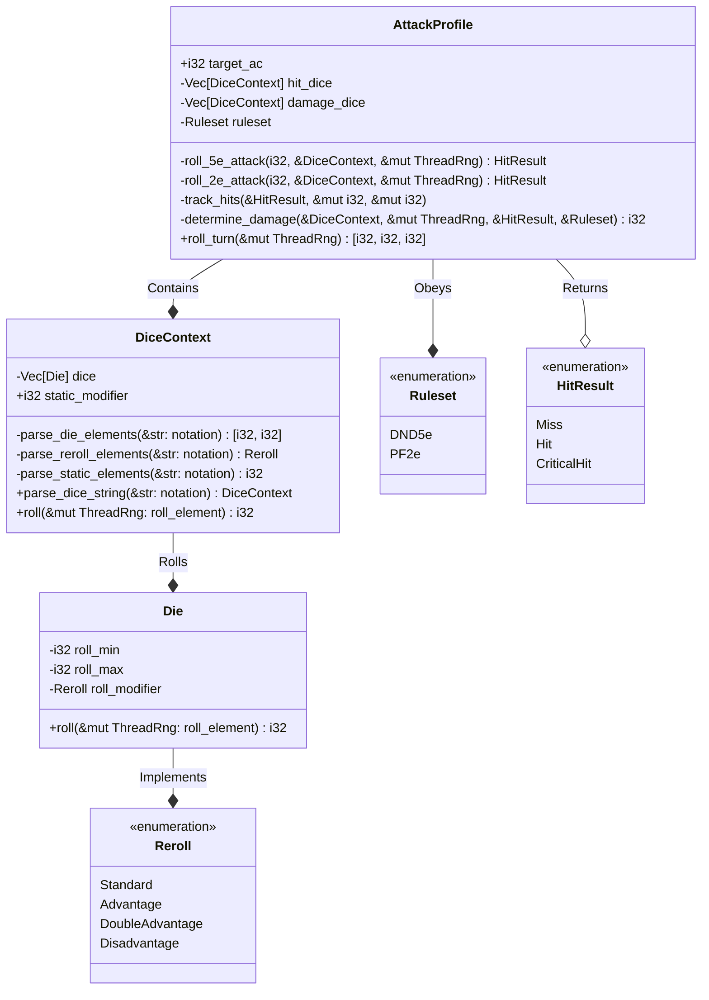

```mermaid
classDiagram

    AttackProfile --* DiceContext : Contains
    AttackProfile --* Ruleset : Obeys
    AttackProfile --o HitResult : Returns
    DiceContext --* Die : Rolls

    Die --* Reroll : Implements

    class AttackProfile {
        +i32 target_ac
        -Vec[DiceContext] hit_dice
        -Vec[DiceContext] damage_dice
        -Ruleset ruleset
        -roll_5e_attack(i32, &DiceContext, &mut ThreadRng) HitResult
        -roll_2e_attack(i32, &DiceContext, &mut ThreadRng) HitResult
        -track_hits(&HitResult, &mut i32, &mut i32)
        -determine_damage(&DiceContext, &mut ThreadRng, &HitResult, &Ruleset) i32
        +roll_turn(&mut ThreadRng) [i32, i32, i32]
    }

    class DiceContext {
        -Vec[Die] dice
        +i32 static_modifier
        -parse_die_elements(&str: notation) [i32, i32]
        -parse_reroll_elements(&str: notation) Reroll
        -parse_static_elements(&str: notation) i32
        +parse_dice_string(&str: notation) DiceContext
        +roll(&mut ThreadRng: roll_element) i32
    }

    class Die {
        -i32 roll_min
        -i32 roll_max
        -Reroll roll_modifier
        +roll(&mut ThreadRng: roll_element) i32
    }

    class HitResult {
        <<enumeration>>
        Miss
        Hit
        CriticalHit
    }

    class Reroll {
        <<enumeration>>
        Standard
        Advantage
        DoubleAdvantage
        Disadvantage
    }

    class Ruleset {
        <<enumeration>>
        DND5e
        PF2e
    }
```
